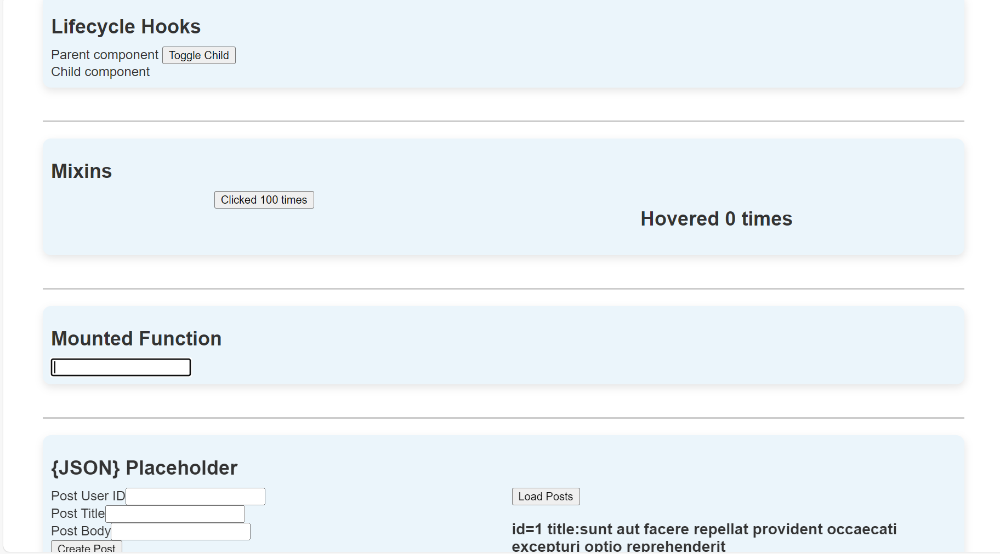

# vue-http

## Description
This project is a demonstration of using Lifecycle hooks and axios

## Execution Demo


## Project setup
```
npm install
```

### Compiles and hot-reloads for development
```
npm run serve
```

### Compiles and minifies for production
```
npm run build
```

### Lints and fixes files
```
npm run lint
```